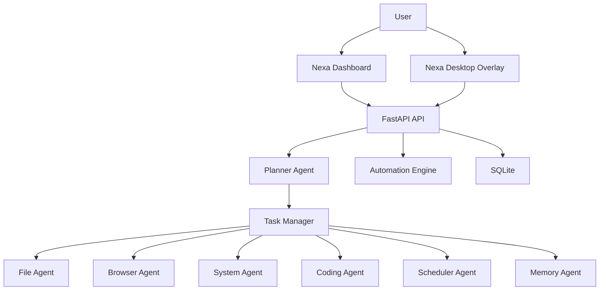

# Architecture

## Backend Modules

- `backend/agents/planner`: command intent detection and workflow planning
- `backend/core/task_manager.py`: task lifecycle, execution, logging, confirmation
- `backend/agents/file_agent`: safe file actions and backups
- `backend/agents/browser`: browser launch and Playwright hooks
- `backend/agents/system`: Windows process and power actions
- `backend/agents/coding`: coding activity snapshots and reports
- `backend/agents/scheduler`: delayed reminders and system jobs
- `backend/automation`: metric-based condition engine
- `backend/database`: SQLAlchemy models and SQLite setup
- `backend/api`: FastAPI routes and request schemas

## Data Model

The SQLite schema includes users, tasks, task executions, events, automations, memory, activity logs, coding sessions, notifications, and settings.

## Security

Dangerous commands are not executed immediately. They enter `pending_confirmation` and require an explicit confirmation API call.
